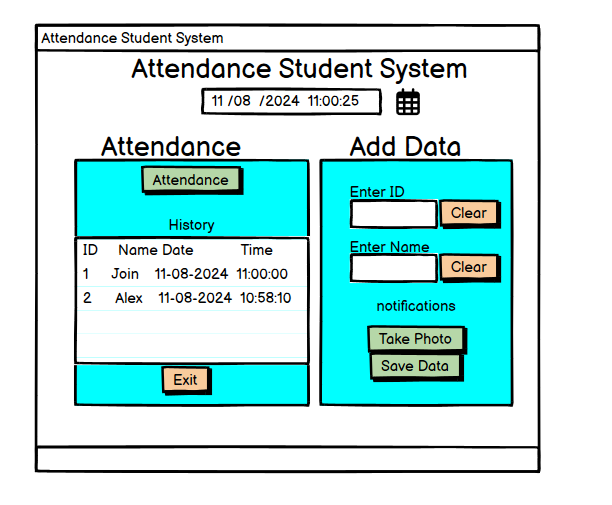

#  🤖 ATTENDANCE SYSTEM USING FACIAL RECOGNITION TECHNOLOGY 🤖

##       Build an automatic attendance system for students using facial recognition technology. Apply Haar Cascade algorithm and Local Binary Patterns Histogram method integrated in OpenCV. The system aims to increase efficiency and accuracy in attendance management, reduce cheating and save time for teachers and students.

### Features:
      1. Add new data: ID, Name, Images from real-time video.
      2. Attendance: Automately: Automatic attendance student via camera and display attendance history.

### Algorithms & Methods:
      1. Haar Cascade: Use algorithms to detect faces in camera frames.
      2. Local Binary Patterns Histograms: Use LBPH for features extraction and facial identification.

### Libraries:
      1. Tkinter: For building user interfaces.
      2. OpenCV: Process images and integrate Haar & LBPH.

### How to work:
      - First, download this project and run main.py
      - Then, enter your information (ID, Name) and choose "Chụp ảnh". The system will connect to the camera and take images automatically.
      - Next, choose "Lưu dữ liệu" for save the images which you have taken.
      - Choose button "Điểm danh" to attendance student. Press "q" if you want to quit or wait a limited times.
      - Display the list of students who have checked in.

Note: 
      1. You will install some libaries like numpy, pandas, dlib,... 
      2. This system is not have database and any complex features like Decentralization and statistics. But, I suggest you to use SQLite or use other franes like Flask, Django. 
